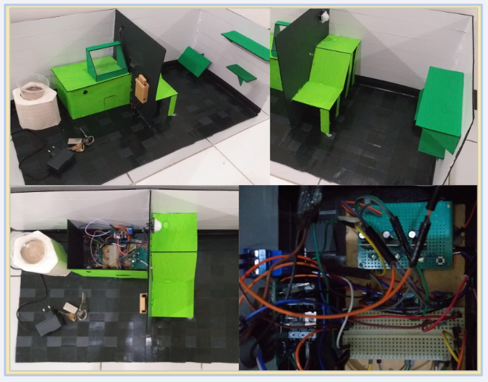
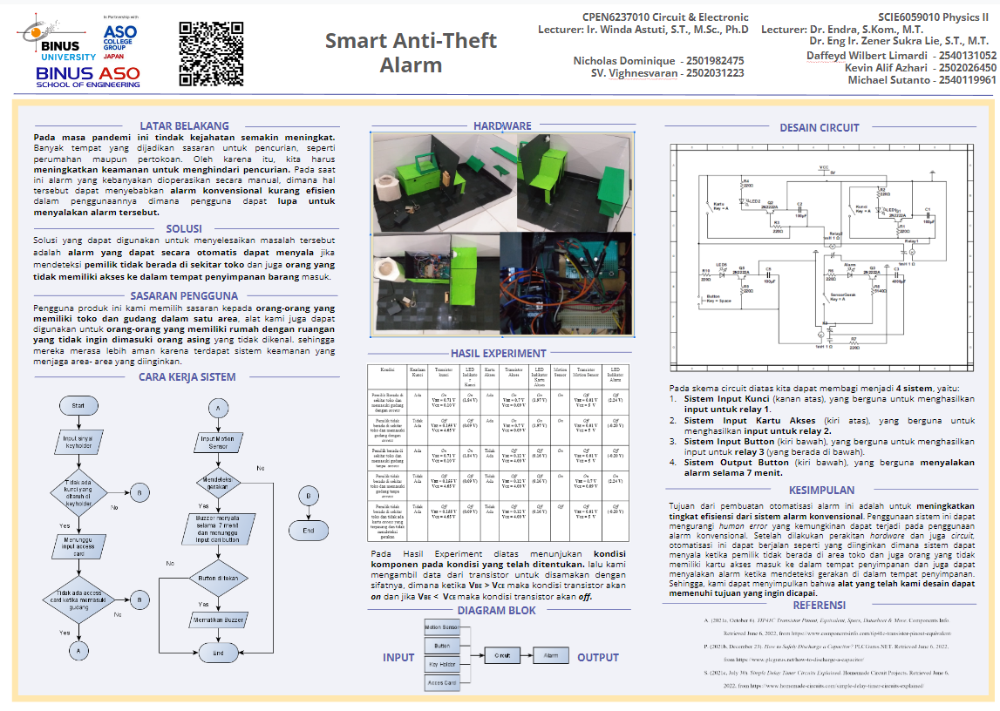
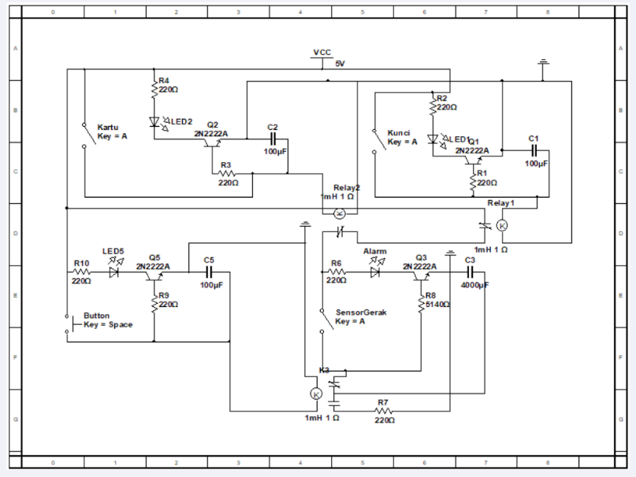

# Smart Anti Theft Alarm
This project help you to make some private area or storage safe from stranger or person that you don't want to get in if you're not around. Person that have your permission of course could get in. If there is any perseon enter your private room or storage it will activate an alarm for 7 minutes.

---

### Table of Contents

- [Description](#description)
- [Documentation](#documentation)
- [Author Info](#author-info)

---

## Description

This project is an automation that didn't use any microcontroller, it only uses electrical componen such as capacitor transistor and anything else. 

Circuit Schematic

[Back To The Top](#Smart-Anti-Theft-Alarm)

---

## Documentation

[Demo Video](https://drive.google.com/file/d/1K9aXgm1o1eiC-OflouxIvdz3pQ0uqImB/view?usp=sharing)

[Back To The Top](#Smart-Anti-Theft-Alarm)

---
## Author Info

- Instagram - [daffeydwilbert](https://www.instagram.com/daffeydwilbert/)
- Email - daffeydwilbert@gmail.com

[Back To The Top](#Smart-Anti-Theft-Alarm)

